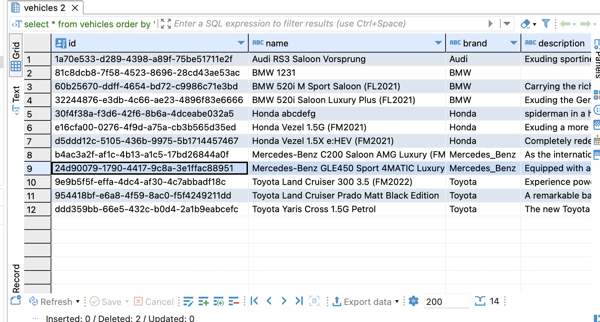
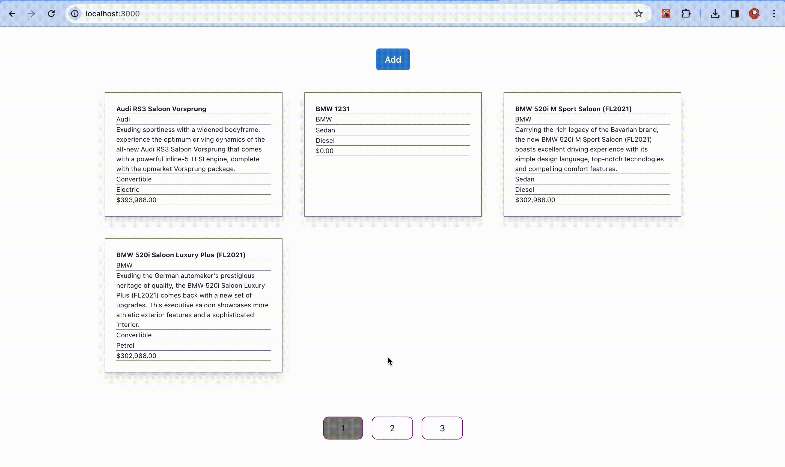

# Vincar Take Home Test

Hello!

This is the take home test that we use to let you showcase your full stack skills. This README will provide some helpful links for you to use as you build out your solution as well as general guidance on what we are looking for.

### Terminology and Technical aspect showcase
- Frontend
  - React custom hooks
  - Formik form state handling and Yup schema validation
  - Mutation handling on sucess and failure to toast popup follow up.
  - Consuming get vehicles query and add vehicle mutation
  - Refractor React components
  - Pagination Mock showcase
  - css modules
- Backend
  - Mutation
    - add vehicle
    - update vehicle
  - Query
    - get all vehicles
  - Custom Error handling example
    - bad user input -> entity already exist

### Mock data display


### Vehicle listing page


### Add Existing Vehicle


### Add New Vehicle, fetch live updated records


### Validation


## Getting Started (pre-requisite)
In backend directory, create .env file from .env.example and run docker compose up to setup local db.

```bash
cp .env.example .env
docker-compose up -d
```

## Running the frontend

```bash
yarn install
yarn start (app should come up on localhost:3000)
```

## Running the backend

```bash
yarn install
yarn watch (server should start on localhost:8080)
```

## The codebase
Technical components

- NextJS, Typescript, TypeORM, Express
- Charka UI, Formik, Yup
  
`src/data-source.ts` is where you should define your postgresql credentials

`src/index.ts` is where you should define your API routes

## Your Task

Your goal for this take home test is to create a full stack application for us to review together.

Both the `frontend` and `backend` folders have their own individual READMEs with guidance on what we will be expecting.

Some things we will be looking for/evaluating when we read your final code submittion are as follows (this list is not exhaustive)

- Code organization/structure
- Code modularity
- Database structure/architecture

## How to Submit

1. Throughout your exercise you should be commiting and pushing code often to your repo/branch. This makes it easier for us to review how you break up your building.

2. Once you have your project finalised and are happy with your solution. Open up a Pull Request for your forked repo into the interview-take-home repo and tag the following people as reviewers `ernessttan` and `dre-draws`
3. Sit back and relax. We will review your submition and will follow up with you to set up a time for us to go through your solution together!

If you have any questions during your take home or are blocked from making progress for any reason please reach out to `ernesttan@vincar.com.sg`.
